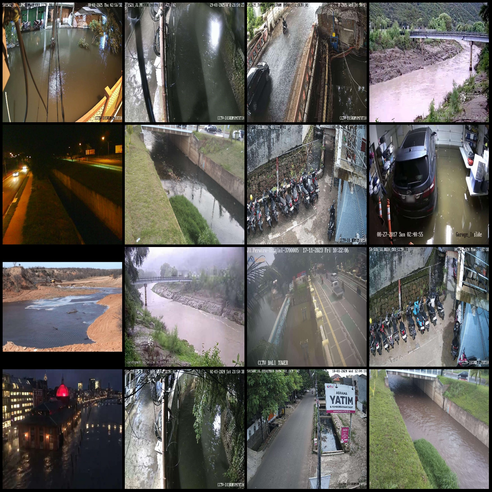
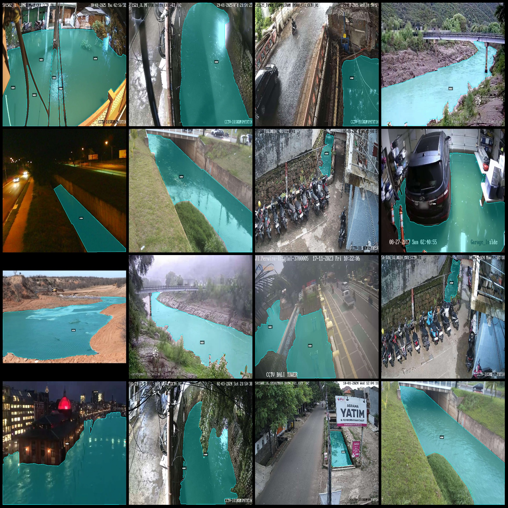
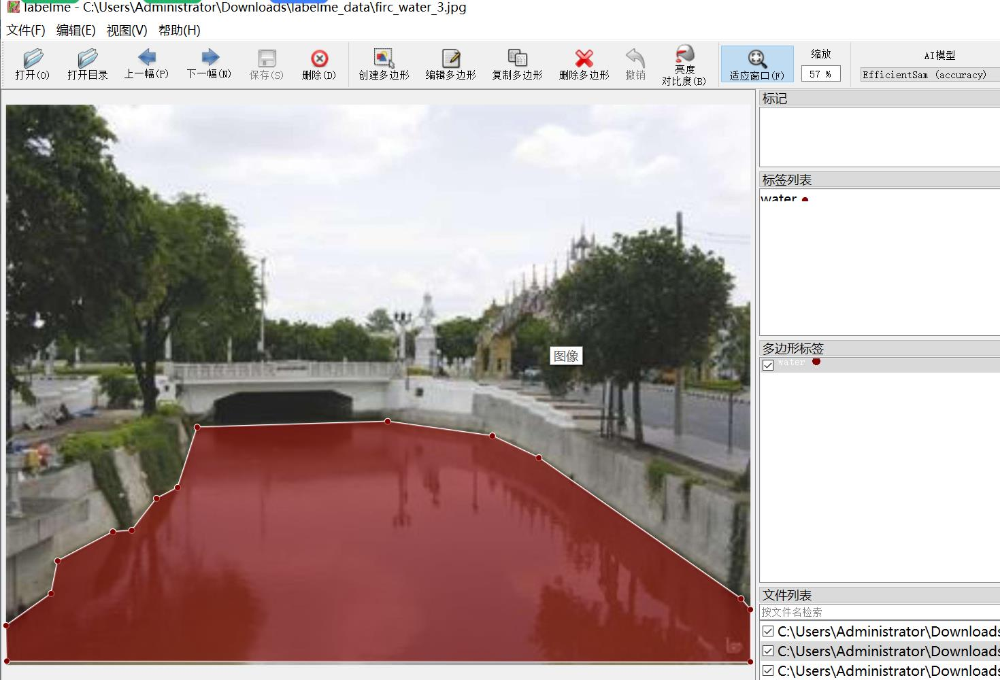

# Monitoring View of River Water Body Identification and Segmentation Data Set - labelme Format with 2812 Images in One Class

Dataset format: labelme format (excluding mask files, only containing jpg images and corresponding json files)
Number of images (number of jpg files): 2812
Number of annotations (json file count): 2812
Number of categories: 1
Category name for annotations: ["water"]
Number of bounding boxes per category: 4045
Total bounding boxes: 4045
Annotation tool used: labelme version 5.5.0
Image resolution: Multi-resolution images, such as 1920x1440, 1920x1079, etc.
Annotation rules: Polygons are drawn around the categories
Important note: The dataset can be edited using labelme, but the json dataset needs to be converted into mask or yolo format or coco format for semantic segmentation or instance segmentation.
Special declaration: This dataset does not guarantee the accuracy of the trained model or weight files.
Image preview:
Annotation examples:
Randomly selected 16 images:
Annotation drawing results:
Labelme editing example image:

## Image

Here is a pay link on Stripe ( https://buy.stripe.com/3cs8yP7sY87d0vu9AB ). Please contact me lonlonago@foxmail.com after funding $89, and I will send you a complete data files , thank you!

